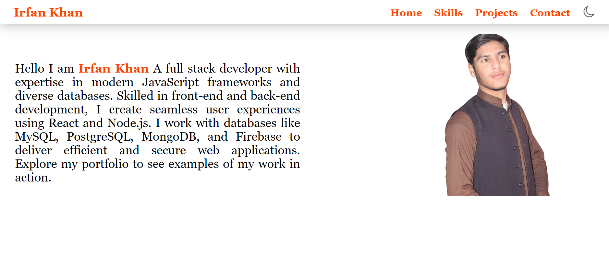
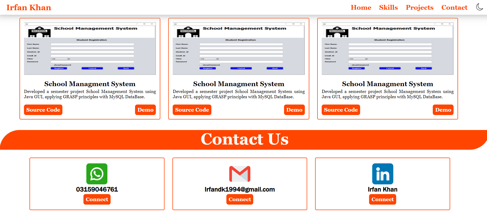

# My Portfolio

Welcome to My Portfolio! This website showcases my skills and projects, highlighting my Skills and journey in web development.

## Description

My portfolio is a collection of web projects built with HTML, CSS, and JavaScript. Explore my work to get insights into my coding style, problem-solving approach, and the technologies I enjoy working with.

## Live Demo

Check out the live demo: [My Portfolio](https://irfankhan761.github.io/MyPortfolio/)

## Screenshots




## Technologies Used

- HTML
- CSS
- JavaScript

## Getting Started

To run this project locally, follow these steps:

1. Clone the repository:

   ```bash
   git clone https://github.com/IrfanKhan761//MyPortfolio.git
